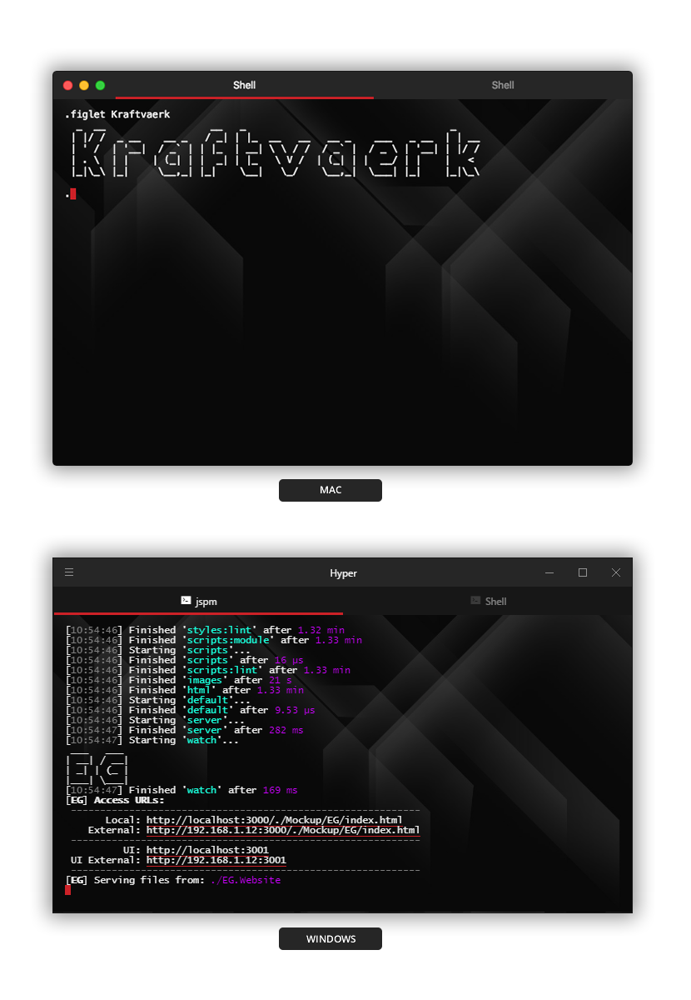

# hyper-kraftvaerk
> A Kraftvaerk theme for [Hyper™](http://hyper.is).

# hyper-kraftvaerk

[](https://travis-ci.org/kraftvaerk/hyper-kraftvaerk)
[](https://www.npmjs.com/package/hyper-kraftvaerk)
[](https://github.com/kraftvaerk/hyper-kraftvaerk/blob/master/LICENSE)



### Install

1. Open Hyper™ preferences with your editor - Tip: `CMD+,` or at `~/.hyper.js`.
2. Add `hyper-kraftvaerk` to your plugins list.
3. Reload Hyper™ - `CMD+Shift+R`.

```js
plugins: ['hyper-kraftvaerk']
```

### FAQ

**Can I make contributions?**

Yes! You can submit an issue and send a pull request :tada:

## Hyper me some more 
Check out [awesome-hyperterm](https://github.com/bnb/awesome-hyperterm)

## License
Created with ♥ by [Mithun Dhiman](https://github.com/mi2oon). Licensed under the MIT License.

